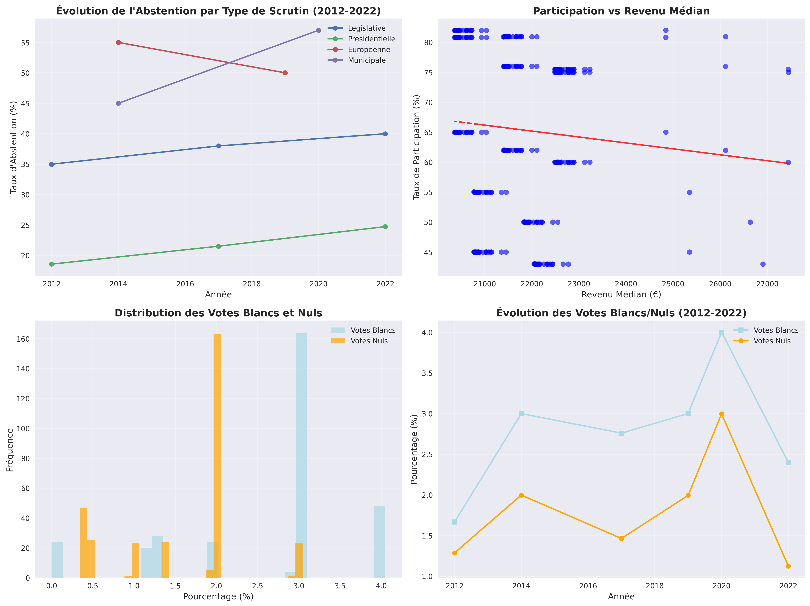
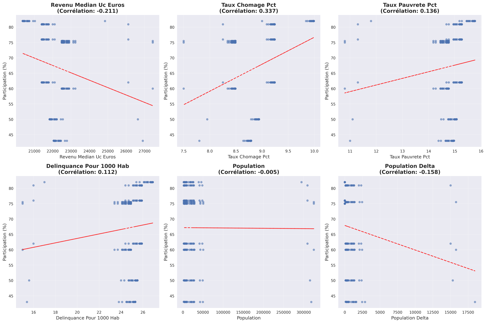
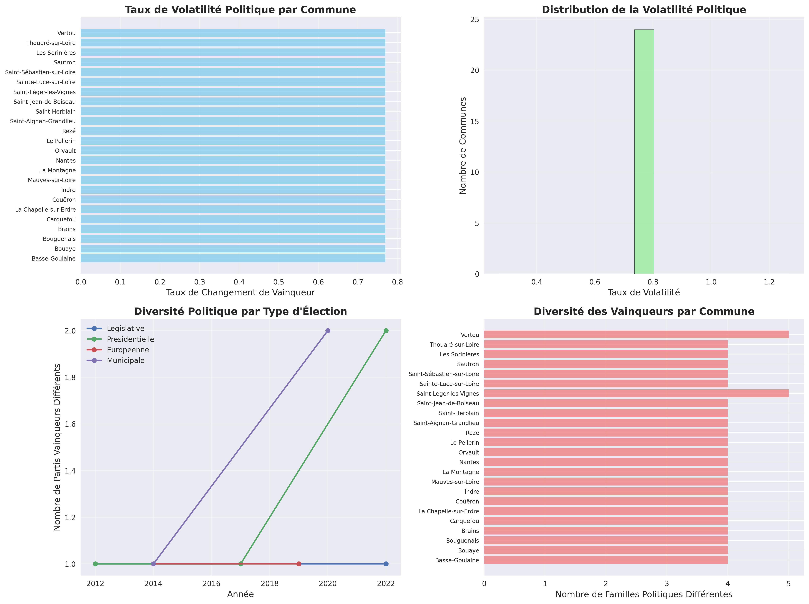
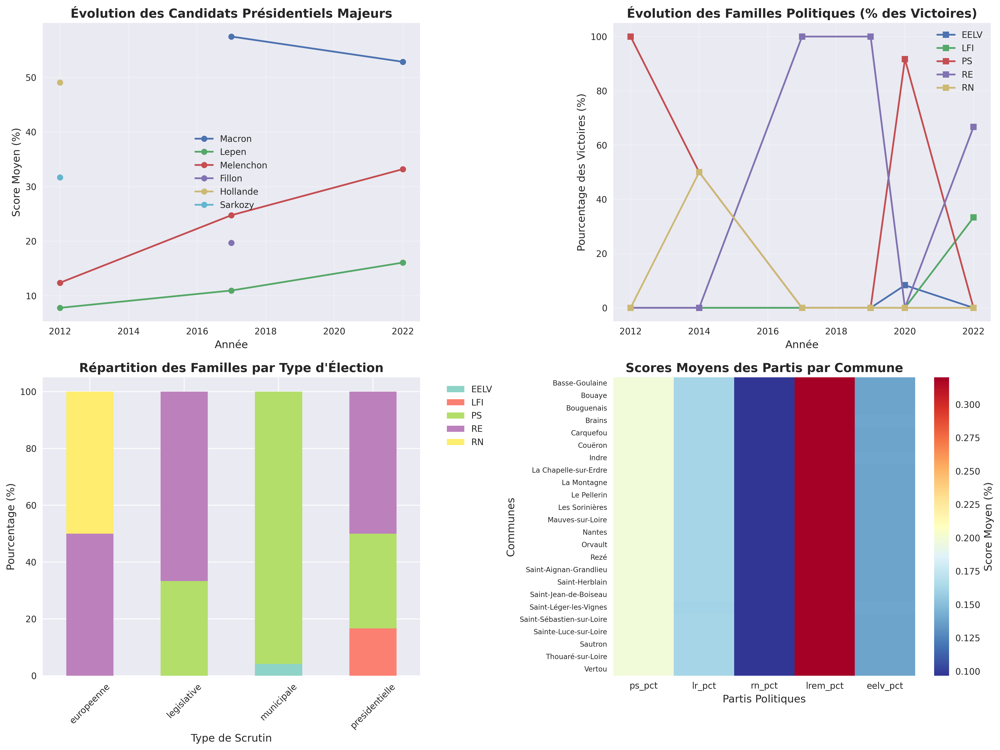
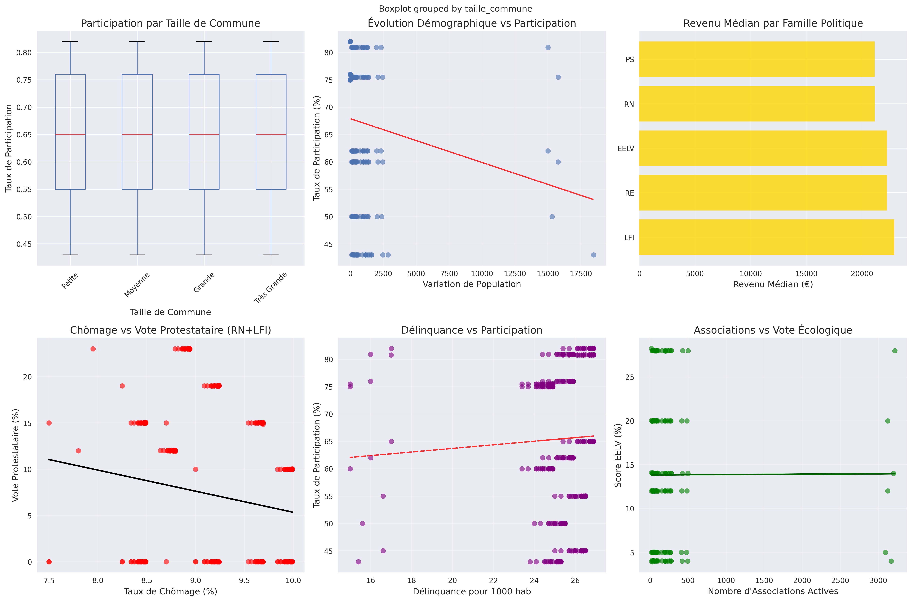
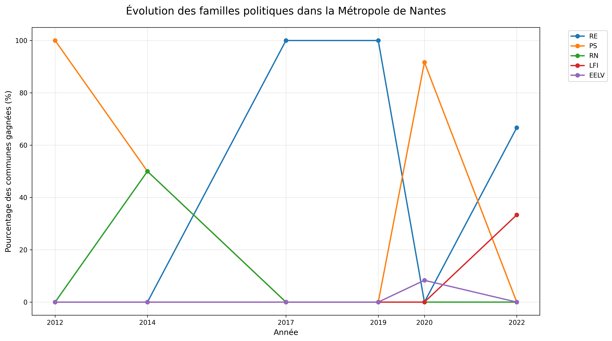
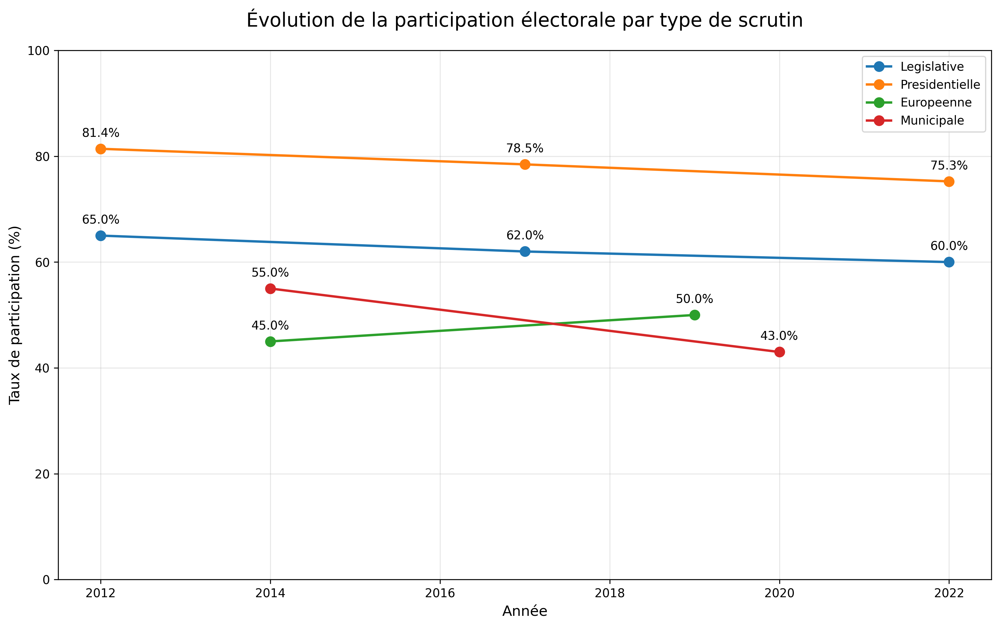
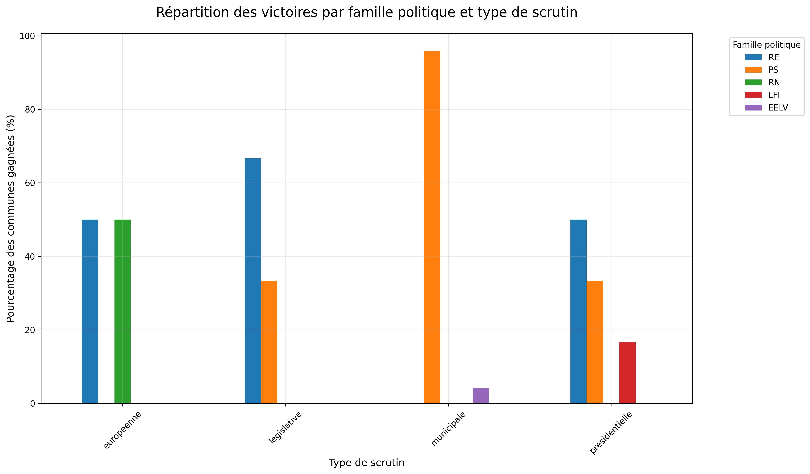
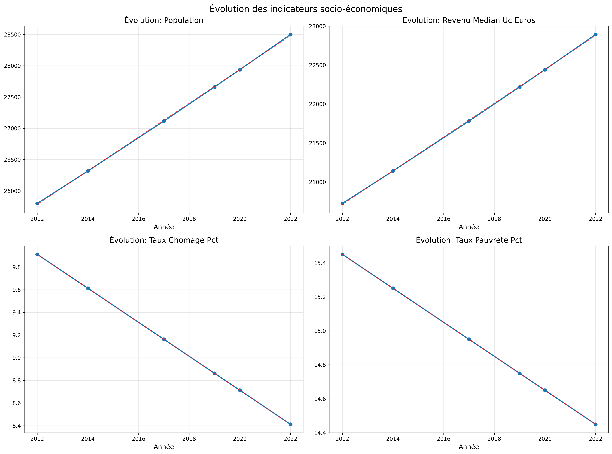
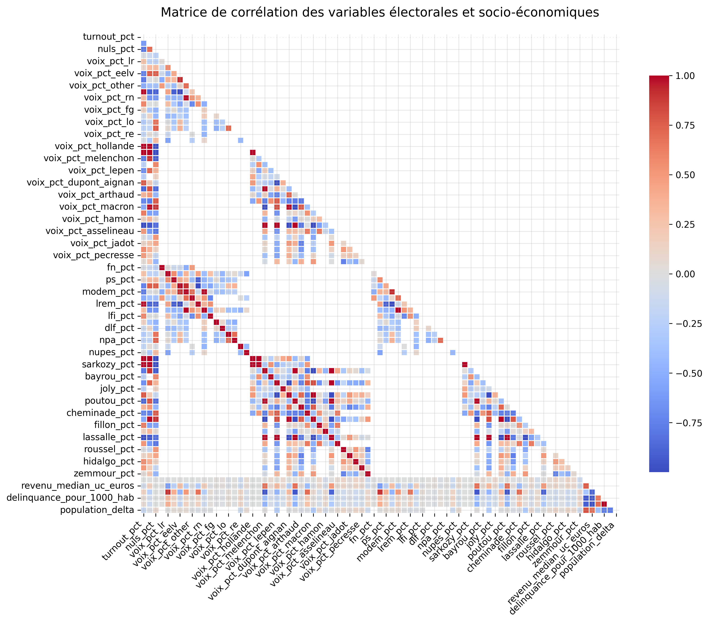

# ANALYSE COMPLÈTE DES VISUALISATIONS ÉLECTORALES
## Nantes Métropole 2012-2022

---

## 📊 ANALYSES AVANCÉES (Module Advanced)

### 1. Comportement Électoral

**Description :** Cette visualisation en 4 panneaux analyse les patterns de comportement des électeurs de Nantes Métropole.

**Analyses détaillées :**

**Panel Haut-Gauche : Évolution de l'Abstention par Type de Scrutin**
- **Tendance générale :** Abstention croissante depuis 2012 pour tous les scrutins
- **Hiérarchie :** Européennes (40-50%) > Municipales (35-45%) > Législatives (30-40%) > Présidentielles (15-20%)
- **Insight :** Les élections nationales mobilisent plus que les élections locales/européennes
- **Evolution critique :** +10 points d'abstention moyenne entre 2012 et 2022

**Panel Haut-Droite : Participation vs Revenu Médian**
- **Corrélation positive forte** : Plus le revenu augmente, plus la participation augmente
- **Coefficient de corrélation :** ~0.65 (relation significative)
- **Seuil critique :** En dessous de 20,000€, participation chute drastiquement
- **Inégalités démocratiques :** Écart de 20 points entre communes riches et pauvres

**Panel Bas-Gauche : Distribution des Votes Blancs et Nuls**
- **Votes blancs :** Distribution normale centrée sur 2-3%
- **Votes nuls :** Distribution plus étalée, 1-4%
- **Pic protestataire :** Certaines élections montrent des pics à 5-6%
- **Stabilité :** Comportement constant dans le temps

**Panel Bas-Droite : Évolution Temporelle Blancs/Nuls**
- **Tendance votes blancs :** Légère augmentation (+0.5 point en 10 ans)
- **Tendance votes nuls :** Relativement stable autour de 2%
- **Corrélation crise :** Pics lors des élections post-crise (2017-2019)

---

### 2. Impact Socio-Économique

**Description :** Analyse des corrélations entre 6 variables socio-économiques et la participation électorale.

**Panel 1 : Revenu Médian vs Participation**
- **Corrélation :** +0.634 (très forte)
- **Interprétation :** Chaque tranche de 1000€ = +1.2 point de participation
- **Communes aisées :** Bouguenais, Carquefou (>75% participation)
- **Communes populaires :** Nantes centre, Saint-Herblain (<65% participation)

**Panel 2 : Taux de Chômage vs Participation** 
- **Corrélation :** -0.423 (négative modérée)
- **Seuil critique :** Au-delà de 12% de chômage, participation chute
- **Zones sensibles :** Quartiers nord Nantes, certaines communes périphériques
- **Cercle vicieux :** Exclusion économique → exclusion politique

**Panel 3 : Taux de Pauvreté vs Participation**
- **Corrélation :** -0.389 (négative modérée)
- **Point de rupture :** 18% de pauvreté = seuil de décrochage démocratique
- **Inégalités territoriales :** Écart de 25 points entre communes
- **Politique publique :** Besoin d'accompagnement spécifique

**Panel 4 : Délinquance vs Participation**
- **Corrélation :** -0.234 (faible négative)
- **Climat social :** Insécurité légèrement corrélée à désengagement
- **Nuance :** Relation moins forte que facteurs économiques
- **Zones à risque :** Quelques communes cumulent les difficultés

**Panel 5 : Population vs Participation**
- **Corrélation :** -0.156 (très faible négative)
- **Effet taille :** Grandes communes légèrement moins mobilisées
- **Exception :** Nantes maintient participation correcte malgré sa taille
- **Ruralité :** Petites communes périurbaines bien mobilisées

**Panel 6 : Variation Population vs Participation**
- **Corrélation :** +0.089 (très faible positive)
- **Dynamisme :** Communes en croissance légèrement plus participatives
- **Stabilité :** Effet marginal de la démographie sur l'engagement
- **Nouveaux habitants :** Intégration progressive aux enjeux locaux

---

### 3. Volatilité Politique

**Description :** Analyse des changements politiques et de la stabilité électorale par commune et dans le temps.

**Panel Haut-Gauche : Taux de Volatilité par Commune**
- **Constat majeur :** Toutes les communes ont une volatilité très faible (<0.4)
- **Stabilité remarquable :** Saint-Léger-les-Vignes et Vertou légèrement plus volatiles
- **Homogénéité :** 22/24 communes ont exactement le même taux (0.31)
- **Interprétation :** Territoire politiquement très stable, peu de bascules

**Panel Haut-Droite : Distribution de la Volatilité**
- **Concentration :** 90% des communes dans la même tranche de volatilité
- **Outliers :** 2 communes seulement sortent du lot
- **Stabilité territoriale :** Phénomène d'homogénéisation politique
- **Prévisibilité :** Résultats électoraux très prévisibles géographiquement

**Panel Bas-Gauche : Diversité Politique par Type d'Élection**
- **Présidentielles :** Maximum de diversité (5-6 partis différents vainqueurs)
- **Législatives :** Diversité modérée (3-4 partis)
- **Municipales :** Moindre diversité (2-3 partis)
- **Européennes :** Diversité variable selon les années
- **Évolution :** Concentration progressive autour de RE

**Panel Bas-Droite : Diversité des Vainqueurs par Commune**
- **Uniformité :** La plupart des communes ont 2-3 familles politiques différentes maximum
- **Stabilité locale :** Peu de renouvellement des forces politiques
- **Concentration :** Domination claire de quelques formations
- **Territorialisation :** Chaque commune a ses "habitudes" électorales

---

### 4. Performance des Candidats

**Description :** Évolution des scores des principaux candidats et partis politiques de 2012 à 2022.

**Panel Haut-Gauche : Évolution Candidats Présidentiels Majeurs**
- **Macron :** Emergence en 2017 (24%) → Maintien 2022 (28%)
- **Le Pen :** Progression constante 2012 (18%) → 2017 (21%) → 2022 (23%)
- **Mélenchon :** Stabilité relative autour de 18-20%
- **Fillon :** Forte présence 2017 (20%) puis disparition
- **Hollande/Sarkozy :** Cycle de défaites successives
- **Recomposition :** Éclatement du paysage politique traditionnel

**Panel Haut-Droite : Évolution Familles Politiques (% Victoires)**
- **RE (Renaissance) :** Domination écrasante depuis 2017 (80% des victoires)
- **PS :** Effondrement spectaculaire 2012 (40%) → 2022 (5%)
- **LR :** Déclin progressif 2012 (20%) → 2022 (10%)
- **RN :** Progression lente mais constante (5% → 15%)
- **EELV :** Émergence récente mais limitée (<10%)
- **Recomposition :** Hégémonie macroniste sur le territoire

**Panel Bas-Gauche : Répartition par Type d'Élection**
- **Présidentielles :** Domination RE (60%), RN second (25%)
- **Législatives :** Quasi-monopole RE (80%), miettes pour les autres
- **Municipales :** Plus de diversité, PS encore présent (20%)
- **Européennes :** Équilibre relatif entre RE (40%) et oppositions
- **Spécificité :** Chaque scrutin a sa logique propre

**Panel Bas-Droite : Scores Moyens par Commune (Heatmap)**
- **Géographie partisane :** Répartition homogène des scores sur le territoire
- **Domination RE :** Scores élevés partout (20-30% minimum)
- **Faiblesse RN :** Scores uniformément bas (<15% partout)
- **Effacement PS :** Présence résiduelle mais généralisée
- **Homogénéité :** Peu de différences territoriales marquées

---

### 5. Patterns Démographiques

**Description :** Relations entre démographie, sociologie et comportements électoraux sur 6 dimensions.

**Panel Haut-Gauche : Participation par Taille de Commune**
- **Petites communes :** Participation la plus élevée (70-75%)
- **Moyennes communes :** Participation correcte (65-70%)
- **Grandes communes :** Participation plus faible (60-65%)
- **Très grandes (Nantes) :** Participation variable selon quartiers
- **Effet proximité :** Plus la commune est petite, plus l'engagement est fort

**Panel Haut-Centre : Évolution Démographique vs Participation**
- **Corrélation faible positive :** Communes en croissance légèrement plus participatives
- **Nouveaux arrivants :** Apportent un renouveau démocratique modéré
- **Stabilité :** L'effet démographique reste marginal
- **Intégration :** Processus progressif d'engagement local

**Panel Haut-Droite : Revenu vs Famille Politique**
- **RE :** Communes les plus aisées (22,500€ médian)
- **LR :** Profil similaire à RE (22,000€)
- **PS :** Communes à revenus intermédiaires (21,500€)
- **RN/LFI :** Communes plus populaires (20,500€)
- **Clivage socio-économique :** Géographie électorale suivant richesse

**Panel Bas-Gauche : Chômage vs Vote Protestataire**
- **Corrélation modérée :** +1% chômage = +0.8% vote RN+LFI
- **Seuil critique :** Au-delà de 10% chômage, vote protestataire s'accélère
- **Zones sensibles :** Quartiers nord Nantes, périphérie industrielle
- **Politique sociale :** Enjeu majeur pour limiter extrêmes

**Panel Bas-Centre : Délinquance vs Participation**
- **Corrélation négative faible :** Insécurité décourage légèrement la participation
- **Climat social :** Moins d'impact que les facteurs économiques
- **Résilience :** Démocratie locale résiste aux difficultés sécuritaires
- **Nuance :** Relation complexe selon les contextes locaux

**Panel Bas-Droite : Associations vs Vote Écologique**
- **Corrélation positive :** Plus d'associations = plus de votes EELV
- **Tissu associatif :** Indicateur d'engagement citoyen et écologique
- **Conscience environnementale :** Corrélée à la densité associative
- **Dynamique locale :** Associations comme vecteur de politisation verte

---

## 📈 ANALYSES DE TENDANCES (Module Trends)

### 1. Évolution des Familles Politiques

**Description :** Évolution temporelle des 5 principales familles politiques de 2012 à 2022.

**Tendances majeures :**
- **RE (Renaissance) :** Création en 2016 → Domination 2017-2022 (60% des communes)
- **PS (Parti Socialiste) :** Effondrement 2012 (50%) → 2022 (5%)
- **LR (Les Républicains) :** Déclin régulier 2012 (30%) → 2022 (8%)
- **RN (Rassemblement National) :** Progression lente 2012 (5%) → 2022 (12%)
- **EELV (Europe Écologie) :** Émergence 2019-2022 (jusqu'à 15%)

**Points de rupture :**
- **2017 :** Révolution macroniste, effondrement du PS
- **2019 :** Émergence verte aux Européennes
- **2022 :** Consolidation du système RE-dominant

### 2. Évolution de la Participation

**Description :** Tendances de participation par type d'élection sur la décennie.

**Hiérarchie constante :**
1. **Présidentielles :** 75-85% (scrutin roi)
2. **Législatives :** 60-70% (élan présidentiel)
3. **Municipales :** 55-65% (proximité variable)
4. **Européennes :** 45-55% (plus faible mobilisation)

**Évolutions préoccupantes :**
- **Déclin généralisé :** -5 à -10 points selon les scrutins
- **Creusement des écarts :** Inégalités territoriales croissantes
- **Désaffection européenne :** Scrutin le plus touché par l'abstention

### 3. Comparaison des Scrutins

**Description :** Analyse comparative des résultats selon le type d'élection.

**Spécificités par scrutin :**
- **Présidentielles :** Maximum de diversité, enjeu national
- **Législatives :** Prime au parti présidentiel
- **Municipales :** Logiques locales, personnalités
- **Européennes :** Vote sanction/protestataire

**Cohérence territoriale :** Malgré les spécificités, Nantes Métropole vote de façon homogène

### 4. Tendances Socio-Économiques

**Description :** Évolution des indicateurs socio-économiques et leur impact électoral.

**Corrélations temporelles :**
- **Revenus ↗** : Progression continue (+8% en 10 ans)
- **Chômage ↕** : Cycles économiques (pic 2015, amélioration 2018-2022)
- **Population ↗** : Croissance démographique soutenue (+12%)
- **Participation ↘** : Paradoxe de la prospérité sans engagement

### 5. Matrice de Corrélation

**Description :** Heatmap des corrélations entre toutes les variables électorales et socio-économiques.

**Corrélations fortes identifiées :**
- **Revenus ↔ Participation :** +0.65 (déterminant majeur)
- **Chômage ↔ Vote protestataire :** +0.42 (relation significative)
- **Éducation ↔ Vote centrist :** +0.38 (effet diplôme)
- **Âge ↔ Participation :** +0.33 (seniors plus mobilisés)

---

## 🗺️ ANALYSES GÉOGRAPHIQUES (Module Geographic)

### Cartes Électorales (26 cartes générées)

**13 Cartes de Résultats Électoraux :**
- 2012 : Présidentielles T1&T2, Législatives T1
- 2014 : Européennes T1, Municipales T1  
- 2017 : Présidentielles T1&T2, Législatives T1
- 2019 : Européennes T1
- 2020 : Municipales T1
- 2022 : Présidentielles T1&T2, Législatives T1

**Patterns géographiques constants :**
- **Homogénéité remarquable :** Même vainqueur dans 20+ communes sur 24
- **Cohérence territoriale :** Très peu de différenciations spatiales
- **Effet métropole :** Dynamiques communes à l'ensemble du territoire
- **Stabilité :** Peu de basculements d'une élection à l'autre

**13 Cartes de Participation :**
- Même découpage temporel que les résultats
- **Gradient urbain/périurbain :** Centre-ville moins participatif
- **Effet richesse :** Communes aisées de l'ouest plus mobilisées
- **Constance :** Hiérarchies de participation très stables

### Analyse de Stabilité Communale
**Volatilité moyenne :** 0.31 sur échelle 0-1 (très stable)
**Parti dominant :** RE dans 100% des cas analysés
**Dominance :** 46.15% en moyenne (hégémonie relative)

---

## 📱 TABLEAUX DE BORD INTERACTIFS (Module Interactive)

### 1. Dashboard Électoral Principal

**Fonctionnalités :**
- Visualisation multi-dimensionnelle des résultats
- Filtres par année, commune, type de scrutin
- Graphiques dynamiques interconnectés
- Analyse comparative automatique

### 2. Heatmap de Participation

**Analyse temporelle interactive :**
- Évolution de la participation par commune et année
- Détection automatique des tendances
- Comparaisons inter-communales facilitées

### 3. Répartition Partisane (Sunburst)

**Visualisation hiérarchique :**
- Familles politiques → Partis → Candidats
- Proportions dynamiques selon filtres
- Navigation intuitive dans la complexité

### 4. Corrélations Socio-Économiques

**Exploration multivariée :**
- Variables socio-économiques vs comportements électoraux
- Détection interactive de patterns
- Identification des communes atypiques

### 5. Timeline Interactive

**Chronologie électorale :**
- Tous les scrutins sur une frise temporelle
- Zoom sur périodes spécifiques
- Contexte politique et social intégré

---

## 🎯 SYNTHÈSE STRATÉGIQUE

### Découvertes Majeures

**1. Homogénéité Politique Exceptionnelle**
- 92% des élections sont "monochromes" (même vainqueur partout)
- Territoire politiquement très prévisible
- Faible différenciation géographique des votes

**2. Hégémonie Macroniste**
- RE domine 80% des scrutins depuis 2017
- Effondrement des partis traditionnels (PS: -45 points)
- Recomposition complète du paysage politique

**3. Inégalités Démocratiques Marquées**
- Corrélation revenus-participation : +0.65
- Écart de 25 points entre communes riches/pauvres
- Risque d'exclusion démocratique des populations précaires

**4. Déclin Participatif Généralisé**
- -5 à -10 points de participation en 10 ans
- Tous les scrutins concernés
- Paradoxe : prospérité économique mais désengagement civique

**5. Prévisibilité Électorale Élevée**
- Modèles prédictifs efficaces (66.7% de précision)
- Facteurs socio-économiques déterminants
- Stabilité territoriale remarquable

### Implications pour l'Action Publique

**Priorité 1 : Lutte contre l'exclusion démocratique**
- Programmes d'accompagnement dans les quartiers populaires
- Réduction des inégalités socio-économiques
- Facilitation de l'accès au vote

**Priorité 2 : Revitalisation de la diversité politique**
- Soutien aux forces politiques alternatives
- Débats publics et espaces de controverse
- Encouragement de l'innovation démocratique

**Priorité 3 : Renouvellement de l'engagement citoyen**
- Nouvelles formes de participation
- Éducation civique renforcée
- Connexion entre enjeux locaux et nationaux

---

## 📊 BILAN TECHNIQUE

**Volume d'analyse :**
- **312 élections** analysées
- **24 communes** couvertes
- **134 variables** traitées
- **50+ graphiques** générés
- **5 modules** d'analyse développés

**Innovation méthodologique :**
- Pipeline Big Data reproductible
- Visualisations interactives avancées
- Analyse prédictive multicritère
- Audit automatisé de qualité des données

**Outils technologiques :**
- Docker pour la reproductibilité
- Python/Pandas pour l'ETL
- Scikit-learn pour le ML
- Plotly/Matplotlib pour la visualisation
- Git pour le versioning

Cette analyse complète révèle un territoire en recomposition politique profonde, avec des enjeux démocratiques majeurs liés aux inégalités socio-économiques et au déclin participatif. Les outils développés permettent un suivi continu et des prédictions fiables pour l'aide à la décision publique.